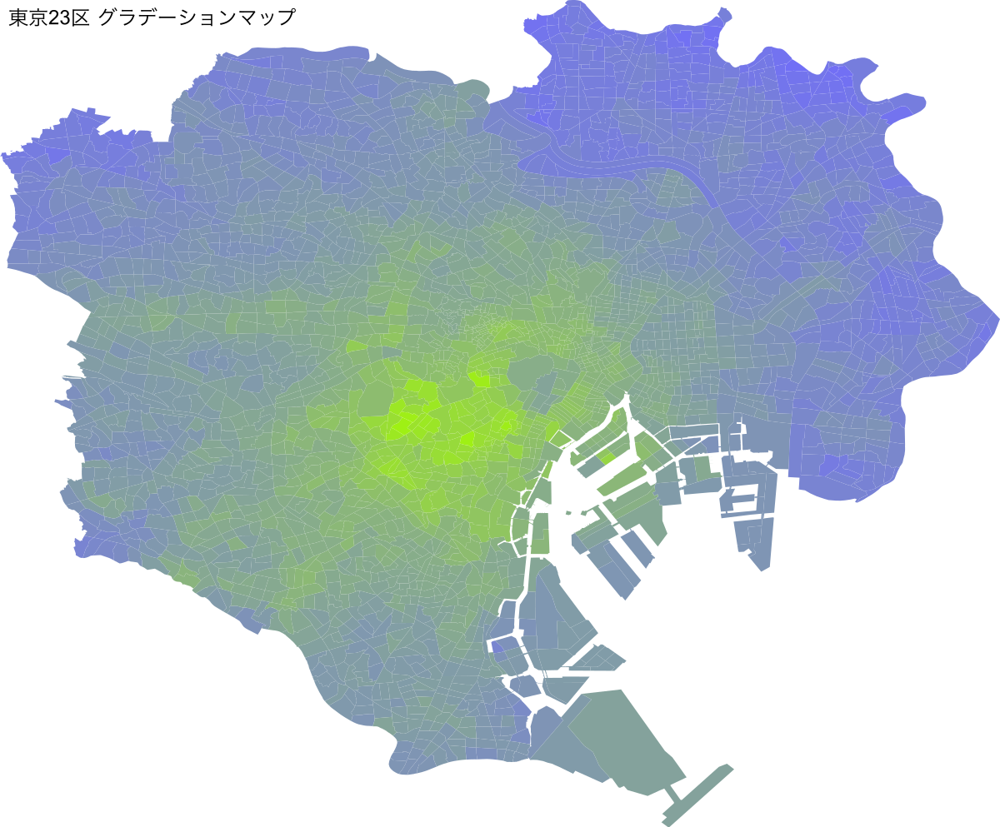

# ジオメトリファイル PNG 出力プログラム

## 目次

- [インストール](#インストール)
- [概要](#概要)
- [起動コマンド](#起動コマンド)
- [コマンドライン引数](#コマンドライン引数)
- [出力先](#出力先)
- [使用ライブラリ](#使用ライブラリ)

<br />

---

<br />

## インストール

<br />

```bash
npm install @shinzo0403/geom-visualizer
```

※ エラーが発生する場合は、[トラブルシューティング](#トラブルシューティング)を参照してください。

<br />

---

<br />

## 概要

<br />

Node.js + TypeScript を使用して、様々な形式のジオメトリファイルを PNG として出力します。全ての工程をストリーミング形式で行っているため、大容量のファイルもインプットできます。

<br />



<br />

全ての拡張子のファイルは一度 GeoJSON Feature にそれぞれ変換されますが、引数にスコアを持つキーを渡すことで、スコアのレンジに対応するカラーグラデーションを作成します。

<br />

---

<br />

## コマンドライン引数

<br />

以下は、プログラム起動時に利用できるオプションの一覧テーブルです。

<br />

| オプション名  | 型     | 説明                                                                             | デフォルト値 |
| ------------- | ------ | -------------------------------------------------------------------------------- | ------------ |
| `inputFile`   | string | 入力ファイルのパス(json,geojson,csv,shp のみ対応)                                | null         |
| `outputDir`   | string | 出力先のディレクトリパス                                                         | out          |
| `title`       | string | キャンバスのタイトル                                                             | title        |
| `encoder`     | string | エンコーダー（[iconv-lite](https://github.com/ashtuchkin/iconv-lite)で有効な値） | utf-8        |
| `canvasWidth` | number | キャンバスの幅                                                                   | 800          |
| `strokeStyle` | string | ストロークスタイル                                                               | #000         |
| `lineWidth`   | number | ラインの幅                                                                       | 1            |
| `fillStyle`   | string | 塗りつぶしスタイル                                                               | red          |
| `bgColor`     | string | 背景色                                                                           | #fff         |
| `scoreKey`    | string | スコアキー                                                                       | null         |

<br />

> **注意**: .shp ファイルは少なくとも.dbf ファイルを含めてください。

<br />

---

<br />

## 使用ライブラリ

<br />

- [**canvas**](https://github.com/Automattic/node-canvas)
- [**Turf.js**](https://github.com/Turfjs/turf)
- [**yargs**](https://github.com/yargs/yargs)
- [**inquirer.js**](https://github.com/SBoudrias/Inquirer.js)
- [**csv-parser**](https://github.com/mafintosh/csv-parser)
- [**stream-json**](https://github.com/uhop/stream-json)
- [**shp-stream**](https://github.com/calvinmetcalf/shapefile)
- [**d3**](https://github.com/d3/d3)

<br />

---

<br />

## トラブルシューティング

<br />

- **Q.** `Error: Cannot find module 'canvas'` と表示される

  - **A.** `canvas` に必要なライブラリがインストールされていません。以下[Automattic/node-canvas]()の README を参考に、必要なライブラリをインストールしてください。

    <br />

    ### Compiling

    If you don't have a supported OS or processor architecture, or you use `--build-from-source`, the module will be compiled on your system. This requires several dependencies, including Cairo and Pango.

    For detailed installation information, see the [wiki](https://github.com/Automattic/node-canvas/wiki/_pages). One-line installation instructions for common OSes are below. Note that libgif/giflib, librsvg and libjpeg are optional and only required if you need GIF, SVG and JPEG support, respectively. Cairo v1.10.0 or later is required.

    | OS      | Command                                                                                                         |
    | ------- | --------------------------------------------------------------------------------------------------------------- |
    | OS X    | Using [Homebrew](https://brew.sh/):<br/>`brew install pkg-config cairo pango libpng jpeg giflib librsvg pixman` |
    | Ubuntu  | `sudo apt-get install build-essential libcairo2-dev libpango1.0-dev libjpeg-dev libgif-dev librsvg2-dev`        |
    | Fedora  | `sudo yum install gcc-c++ cairo-devel pango-devel libjpeg-turbo-devel giflib-devel`                             |
    | Solaris | `pkgin install cairo pango pkg-config xproto renderproto kbproto xextproto`                                     |
    | OpenBSD | `doas pkg_add cairo pango png jpeg giflib`                                                                      |
    | Windows | See the [wiki](https://github.com/Automattic/node-canvas/wiki/Installation:-Windows)                            |
    | Others  | See the [wiki](https://github.com/Automattic/node-canvas/wiki)                                                  |

    **Mac OS X v10.11+:** If you have recently updated to Mac OS X v10.11+ and are experiencing trouble when compiling, run the following command: `xcode-select --install`. Read more about the problem [on Stack Overflow](http://stackoverflow.com/a/32929012/148072).
    If you have xcode 10.0 or higher installed, in order to build from source you need NPM 6.4.1 or higher.

    <br />

- **Q.** `.shp` ファイルを読み込むとエラーが発生する

  - **A.** `.shp` ファイルは少なくとも `.dbf` ファイルを含めてください。

      <br />

    また、[shp-stream]() に対応する `.shp` ファイルでない場合は読み込むことができません

    <br />

    ドキュメント：

    Caveat emptor: this library is a work in progress and does not currently support all shapefile geometry types (see [shp.js](https://github.com/mbostock/shapefile/blob/master/shp.js) for details). It also only supports dBASE III and has no error checking. Please contribute if you want to help!

<br />

---

<br />

## TODO:

<br />

- `jest` によるテストコードの追加

- `eslint` によるコードの整形

- `postgres` と連携して、データを取得する機能の追加
